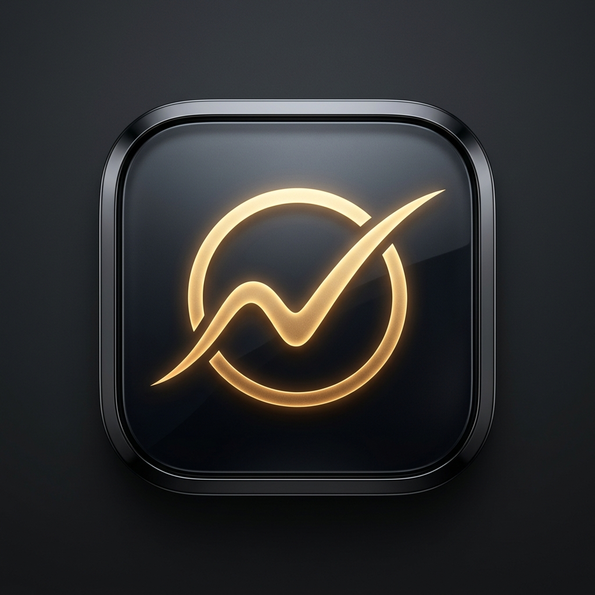
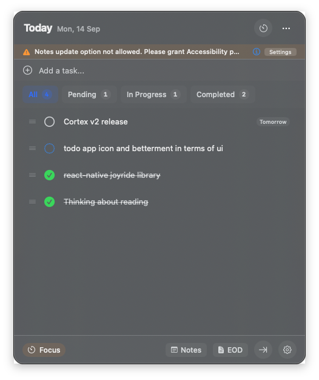
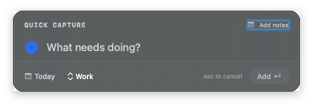
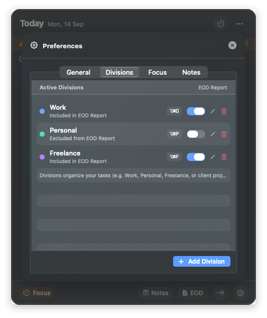
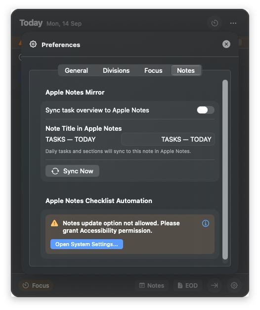

<div align="center">
  
  <h1>To Do</h1>
  <p><b>A native macOS menu bar task companion with real-time two-way Apple Notes synchronization.</b></p>
  <p>
    
    
    
    
  </p>
</div>

---

## Visual Tour

### 1. Main Dashboard & Quick Capture HUD
To Do lives in your menu bar. Toggle the full daily dashboard with `⌥⌘T`, or summon the Quick Capture HUD anywhere in macOS with `⌥ Space`.

<div align="center">
  
  &nbsp;&nbsp;
  
</div>

<br>

### 2. Dynamic Divisions & Apple Notes Preferences
Manage custom divisions without locked defaults. Configure custom shortcut keys (`⌥⌘O` for Work, `⌥⌘P` for Personal, `⌥⌘F` for Freelance), toggle EOD report inclusion, and customize the target note name in Apple Notes.

<div align="center">
  
  &nbsp;&nbsp;
  
</div>

---

## Key Capabilities

- **True Two-Way Apple Notes Mirroring**:
  - Automatically mirrors your daily tasks into Apple Notes with native interactive checklist formatting.
  - Checking off items on your iPhone or Apple Watch in Apple Notes syncs back into To Do within seconds.
  - Zero-pollution synchronization: task deletion and status changes reflect faithfully across both surfaces.

- **Zero-Lock Mutable Divisions**:
  - No locked "system default" divisions—every division is 100% creatable, editable in-place, and deletable.
  - Set custom shortcut keys (`⌥⌘O` for Work, `⌥⌘P` for Personal, `⌥⌘F` for Freelance), accent colors, and names.
  - Toggle whether a division's completed tasks appear in your daily End-of-Day (EOD) report.

- **Automatic Daily Rollover**:
  - Past unfinished tasks automatically roll over to **Today** when a new day arrives or when your Mac wakes.
  - No manually dragging tasks forward or losing yesterday's pending work.

- **Configurable Target Note**:
  - Choose any note title in Apple Notes (default: `"TASKS — TODAY"`) from **Preferences -> Notes**.

- **Integrated Focus Timer**:
  - Built-in 25-minute Pomodoro timer displayed directly in your macOS menu bar button.

- **One-Click End-of-Day (EOD) Reports**:
  - Instant Slack-ready or email-ready summaries of all completed and carried-forward tasks, automatically isolated by workspace.

- **Zero Electron Overhead**:
  - Pure native Swift 6 and AppKit architecture with a near-zero memory footprint and instantaneous startup.

---

## Global Keyboard Shortcuts

| Shortcut | Action | Scope |
| :--- | :--- | :--- |
| `⌥ Space` | **Quick Capture HUD** | Global (any application) |
| `⌥⌘T` | **Toggle Main Task Panel** | Global (any application) |
| `⌥⌘O` | **Switch to Work Division** | Global (dynamic) |
| `⌥⌘P` | **Switch to Personal Division** | Global (dynamic) |
| `⌥⌘F` | **Switch to Freelance Division** | Global (dynamic) |
| `Return` | **Submit new task** | In Task Panel / Quick Capture |
| `Click` | **Cycle task (Pending -> In Progress -> Completed)** | In Task Panel |
| `⌘,` | **Open Preferences** | In Task Panel |

*All division shortcuts (`⌥⌘[Key]`) dynamically update whenever you configure custom shortcuts in Preferences.*

---

## Installation & Quick Setup

To Do provides an automated one-click executable installer that copies the app to `/Applications`, configures macOS permissions, removes quarantine flags, and starts the menu bar companion.

### Option 1: One-Click Installer (Recommended for Everyone)

Double-click **`Install To Do.app`** in Finder.

A guided native macOS installer will:
1. Build the release package automatically if needed.
2. Install `Todo.app` into your `/Applications` directory.
3. Remove Gatekeeper quarantine and verify security signatures.
4. Set up Apple Notes automation permissions.
5. Launch To Do directly into your menu bar.

### Option 2: Terminal / Developer Setup

Run the installation command in your terminal:
```bash
git clone https://github.com/fazalur076/Todo.git
cd Todo
make install
```
*(Alternatively, you can double-click **`Install.command`** in Finder).*

### macOS Permissions

On first launch or installation, To Do will request:
1. **Automation (Apple Events)**: To create and mirror tasks into Apple Notes. Click **Allow**.
2. **Accessibility** *(Optional, recommended)*: To apply native Apple Notes checklist formatting (`Title` and `Checklist` styles) seamlessly. Enable **To Do** under:
   `System Settings -> Privacy & Security -> Accessibility`

---

## Automated Testing

To Do includes an assert-based logic test suite validating workspace isolation, move-to-tomorrow calculations, dynamic division parsing, and Apple Notes checklist sync:

```bash
./Scripts/run_logic_tests.sh
```

---

## Architecture

```
Todo/
├── Sources/
│   ├── ProductivityCore/          # Core Business Logic & State
│   │   ├── AppState.swift          # Central state, division manager, daily rollover
│   │   ├── Models/                 # TaskItem, FocusSession, Workspace, EODSnapshot
│   │   ├── Services/               # NotesSyncService, ShortcutService, FocusService
│   │   └── Resources/              # note_extractor.py (SQLite/protobuf parser)
│   └── ProductivityApp/           # macOS Menu Bar Application
│       ├── App/                    # App entry point & lifecycle
│       ├── AppKitBridge/           # MenuBarController & FloatingPanel NSPanel
│       ├── Features/               # Tasks, QuickCapture, Settings, Focus, EOD
│       └── Resources/              # AppIcon.icns
├── Scripts/
│   ├── build_app.sh               # Release builder & code signer
│   └── run_logic_tests.sh         # Headless assertion test suite
└── Assets/                        # Screenshots & brand assets for documentation
```

---

## License

This project is licensed under the MIT License - see the [LICENSE](LICENSE) file for details.
